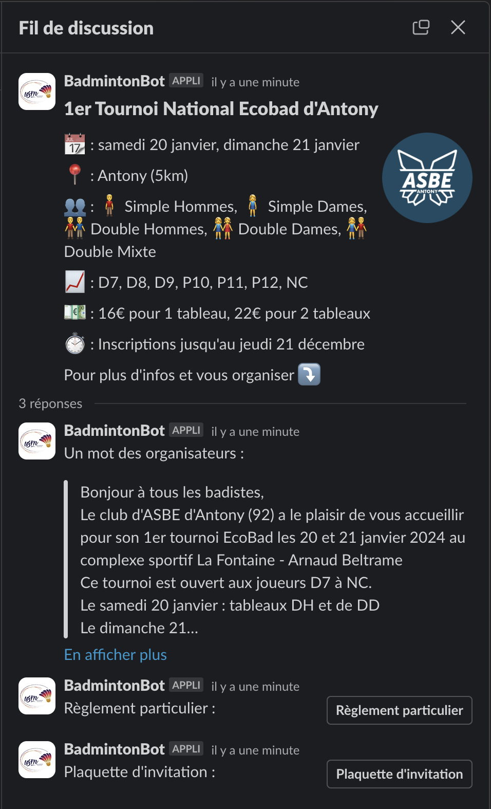

# French badminton tournaments Slack notifier
[](https://github.com/amourany/ffbad-tournaments-slack-bot/actions/workflows/branches.yml)

This is an app publishing Slack messages about new badminton tournaments available in France.

This app aims to notify players when a new badminton tournament is approved by the French Badminton Federation (FFBad) near them.

## Features
Every published tournaments includes all the useful information:
- Tournament dates span
- Location and distance relative to the specified club
- Opened events (MS, WS, ...)
- Allowed rankings
- Entry prices
- Withdrawal deadline
- Tournament-specific rules

It can be fully customized to search new tournaments:
- Around club location within said radius
- Within said players ranking
- For any age categories

## Example
Here is an example of what a message looks like



## Getting Started
Here are the steps needed to run the app for your club.

### Download
Download the app from the [Releases](https://github.com/amourany/ffbad-tournaments-slack-bot/releases) page

### Prerequisites
- AWS Lambda: The app is designed to be an [AWS Lambda](https://aws.amazon.com/lambda/) application
- AWS DynamoDB: The app stores already published tournaments inside an [AWS DynamoDB](https://aws.amazon.com/dynamodb/) database
- Slack: Obviously a Slack workspace is required in order to publish messages

_NB: This app uses very few AWS resources, it should never go over the [AWS Free-Tier program](https://aws.amazon.com/free/?all-free-tier.sort-by=item.additionalFields.SortRank&all-free-tier.sort-order=asc&awsf.Free%20Tier%20Types=tier%23always-free&awsf.Free%20Tier%20Categories=categories%23serverless%7Ccategories%23databases)_

### Installation
The following instructions should help you deploy the app:
1. Create a new [Slack App](https://api.slack.com/apps) with any name you want and add it to your Slack workspace.

   Inside `Settings > Basic Information`: Configure the features "Bots" and "Permissions".

   In "Permissions" the app only need the scope (Bot Token Scopes) `chat:write`
   
   In this section, you can also find your _Bot User OAuth Token_ (`xoxb-XXX), it will be needed later
2. The FFBad API requires 2 header tokens: see [MyFFBad tokens](docs/MyFFBad-tokens.md) on how to retrieve both of them
3. Create a new DynamoDB database with a table named `PublishedTournament`
4. Create a new IAM User for the previously created database, with RW authorizations on it
5. Set up a new AWS Lambda function and set it to run on a `Java 17` environment and `x86_64` architecture
6. Upload the `.jar` file you want to run
7. In the _Runtime settings_ section, set the _handler_ to `org.springframework.cloud.function.adapter.aws.FunctionInvoker::handleRequest`
8. Provide the following environment variable to the Lambda function (from the configuration panel):
    ```
   // DynamoDB
   AWS_DYNAMODB_ENDPOINT: dynamodb.XXX.amazonaws.com
   DYNAMO_ACCESS_KEY: <dynamodb_user_access_key>
   DYNAMO_SECRET_KEY: <dynamodb_user_secret_key>
   
   // MyFFBad header tokens
   SEARCH_VERIFY_TOKEN: <myffbad_header_search_verify_token>
   DETAILS_VERIFY_TOKEN: <myffbad_header_details_verify_token>
   
   // Slack
   SLACK_CHANNEL: #my-tournaments-channel
   SLACK_TOKEN: xoxb-XXX
   ```
9. _Optional:_ You may want to automatically and regularly trigger the function. [AWS EventBridge (CloudWatch Events)](https://aws.amazon.com/eventbridge/) can be a good option.

   Just set up the function to be triggered using a CRON-based event. Tournaments are not published that often, triggering the function once (or twice) a day is more than enough.

### Usage
To perform a search, the app expects a `json` input containing the search parameters.
The parameters must be provided when triggering the lambda.

Here is an example of the expected `json` input
```json
{
  "zipCode": "92240", // French zip code of location to search from 
  "distance": 12, // Radius in km to search around zip code
  "subLevels": ["R6","D7","D8", "D9"], // Players rankings to include for the search. 
                      // It will search for any subset of specified rankings.
                      // Values are from FFBad official ranking names (From N1 to NC)
  "categories": ["SENIOR", "VETERAN"] // Age categories to search tournaments for.
  // It will search for any subset of specified categories.
  // Values are from FFBad official age categories names (From MINIBAD to VETERAN)
}
```

_NB: If your using a CloudWatch Event to trigger the function, this input can be set as the payload of the event._

## Contribution
If you have any suggestion on how to improve the app, feel free to open an issue. 
I'll be happy to consider it ! 
